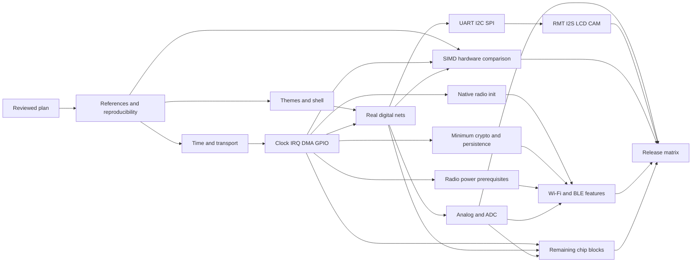

# ESP32-S3 simulator development plan — 2026-10-07

Status: researched implementation plan; independent review results are recorded
in [plan-review.md](plan-review.md). This document plans work, not completed
capabilities. The active Codex goal covers implementation after the planning gate.

## 1. Outcome and accepted scope

Build a usable local circuit studio around **Espressif's official QEMU fork** that
runs ordinary ESP32-S3 firmware, connects it to external device models, and makes
observable hardware behavior inspectable. The user confirmed these additions:

* Persisted light/dark appearance and easier IBM Carbon aligned interaction.
* Real electrical connectivity, **including analog voltages and ADC behavior**.
* Broad ESP-IDF compatibility through hardware modeling; prioritize recent releases
  and retain older S3 releases in the compatibility backlog. Arduino remains in scope.
* Full peripheral behavior, Wi-Fi, Bluetooth LE, chip internals and SIMD.
* An ESP32-S3 board is available for reference tests through Windows **COM5**.
* Subagents may audit, review and implement disjoint work in parallel.

The simulator must not require firmware-side JSON logging, replacement ESP-IDF
drivers, ELF-symbol interception, or special QEMU-only peripherals to qualify a
real peripheral. Such developer modes can exist but have separate capability labels.

The fidelity contract is functional register/ISA behavior, documented side effects,
event timing derived from modeled clocks, and the explicitly supported analog
component models. QEMU instruction counting is not physical CPU cycle accuracy.
RF waveform/antenna simulation and arbitrary SPICE semiconductor circuits need
separate models and evidence. They are tracked as extensions, not silently implied
by a working socket, ADC read or voltage divider. [QEMU instruction counting](https://www.qemu.org/docs/master/devel/tcg-icount.html)

## 2. Evidence and source policy

The [current evidence](current-status.md) remains the support baseline. Old generated
roadmaps are investigation leads. A register array, successful command request,
artificial DONE interrupt, or host-model test does not prove native firmware support.

| Baseline | Recorded value |
| --- | --- |
| Product checkout | `8cb306f` plus preserved local changes, branch `codex/simulator-foundation` |
| Recovered owner QEMU | `33c2bdd17104b3baeea3b788bafd27b2f921c13f`, candidate extensions |
| Official installed QEMU | `9.2.2 (esp_develop_9.2.2_20260417)` |
| Official source release to port onto | tag `esp-develop-9.2.2-20260417`, `40edccac415693c5130f91c01d84176ae6008566`, verified by remote refs |
| Official moving branch inspected | `febae182e132e4055529be423a818225ebddaa3a`; comparison only |
| Tested firmware toolchain | IDF `6.2-dev`, `25fe69f946311abdaf9ad56591f25fedbc20ac98` |
| New stable qualification target | IDF `v6.1`; resolve full tag/toolchain/blob hashes in M0 |
| Studio/build platform | Qt 6.4.2 / GCC 13 / Ubuntu 24.04 / WSL2 |
| Hardware inventory | COM5 is enumerated; no port opened, board identity or reference results yet |
| Planning baseline rerun | 5/5 existing CTest targets passed, 0 skipped, both firmware images, 8.49 s |

The rerun used the recovered extension; the prior official runtime boot test is
documented separately. Do not present the five-target run as an official-QEMU
full-peripheral test. Native I2C currently uses cached responses in the extension.

ESP-IDF v6.1 is the latest stable release inspected, while the successful local
fixture uses a development branch. Arduino 3.3.12 uses IDF 5.5.5. These must be
distinct test profiles. [IDF release](https://github.com/espressif/esp-idf/releases/tag/v6.1),
[Arduino release](https://github.com/espressif/arduino-esp32/releases/tag/3.3.12)

Each implementation decision cites a pinned source revision, relevant TRM/errata
section, or a hardware capture. Live documentation links below are research inputs;
M0 archives revision/hash metadata for reproducibility. Conflicting documentation
becomes a test question. QEMU master documentation describes a newer version than
our runtime, so APIs must be checked against the pinned source before coding.

## 3. Findings that affect the plan

| Finding from current source audit | Consequence |
| --- | --- |
| Dark colors occur in QSS, QPainter canvas and several device panels | Central semantic tokens must reach every drawing surface; theme switching must preserve scene state |
| QProcess startup is displayed as execution; Control/Debug duplicate firmware controls | Structured runtime state and one firmware profile precede shell polish |
| GPIO input mirrors enabled output; matrix/IOMUX mostly store registers | Circuit metadata cannot become electrical connectivity by UI changes alone |
| Clock enables/resets mostly store bits; GDMA lacks persistent streaming progress | Correct clocks/reset/IRQ/DMA are shared prerequisites |
| I2C repeated START internally ends the transfer | Existing sensor success does not qualify repeated START semantics for arbitrary devices |
| GP-SPI emits TX, fills DMA RX from TX storage and immediately completes | Real MISO, CS selection and timed completion need new data paths |
| I2S performs a bounded immediate kick; LCD discards pixels; CAM has no proven frame source | Clocked producers/consumers, buffer ownership and backpressure are required |
| Wi-Fi RX immediately releases empty descriptors; virtual AP has no demonstrated WPA handshake | Native driver init and descriptor correctness precede network feature work |
| BLE has synthetic QEMU HCI registers and explicitly rejects pairing | First qualify unchanged vendor controller initialization; custom bypass cannot meet native compatibility |
| SIMD translator exists, including a suspicious unsigned MAC saturation expression | Opcode presence is not qualification; compare exact states against hardware |
| Existing CI can skip firmware tests; coex soak only checks grant counters | Required integration lanes must fail when fixtures/evidence are missing; radio traffic must be asserted |

Detailed source findings, per-feature work and primary links are in
[UX](plans/ux.md), [peripherals/electrical](plans/peripherals-electrical.md),
and [radio/SIMD](plans/radio-simd.md). These three documents form part of this plan.

## 4. Architecture decisions and contracts

### 4.1 Official base and product boundary

Keep the recovered checkout intact while comparing/porting individual models to
the exact official release. Prepare a separate LF source checkout under WSL2.
Audit ancestry, register maps, machine wiring and tests before copying code. Carry
a reviewed, reproducible patch series with base SHA, patch hashes, capabilities and
build manifest; never keep the only implementation in an ignored build directory.
Promote the new source/submodule pointer only after the official baseline and
extension boot suites both pass. Rebase/upgrade is a separate evidence-producing task.

QEMU owns CPU/peripheral/net electrical state and virtual-time scheduling. Product
UI, persistence, orchestration and independently developed device processes remain
separate executables. QEMU modifications retain their existing licenses.
[QEMU license](https://www.qemu.org/docs/master/about/license.html)

### 4.2 One project and one connectivity model

Introduce a versioned `ProjectDocument` and `QUndoStack`-backed commands. It contains
board/chip/module profile, firmware artifacts, components with stable IDs and typed
terminals, nets with endpoint IDs, device settings, simulation profile and UI layout.
IDs survive rename, save-as, undo and reload. Firmware GPIO matrix configuration is
an observed hardware state, not a circuit-editing instruction.

Board terminal `mcu.gpio8` connects to device `sensor0.sda` through a named net;
that net can also connect a pull-up and another device. SPI CS, display DC/reset,
power and ground are ordinary terminals. Controller/address is a decoder/device
attribute, not connectivity truth. Both pin-level and optimized bus paths derive
reachable endpoints from this graph and actual pin routing/driver state.

Migrate old version-2 bus/pin documents without inventing physical results: preserve
original assignments, mark assumptions in a migration report, and request explicit
power/pull components when absent. Save atomically. Separate Save, Save As and Apply;
layout-only edits never restart QEMU or device processes. Runtime topology changes
occur at a quiescent virtual boundary and create a new topology generation.

### 4.3 Digital and analog kernel

Digital terminals carry input enable, output enable, mux/function, inversion,
push-pull/open-drain, pulls, pad hold and board availability. Resolve high/low,
floating, contention and indeterminate states; never silently turn floating into
a valid low. GPIO input sampling, matrix feedback and IRQs use resolved pin state.
Because a guest register returns bits, unresolved pad sampling needs an explicit
profile: seeded sampled values with unknown provenance in trace/UI, or strict mode
that pauses with a wiring error. Do not claim a chosen bit is a valid electrical
level. Record seed/sampling events and test their IRQ implications.

Analog release scope includes rails/ground, independent voltage sources with finite
source resistance, resistors, potentiometers, switches, capacitors and GPIO driver
impedance. Use deterministic nodal equations for DC and a specified linear RC
transient integration method. Include initial capacitor state, topology changes,
singular/floating nodes, conflicting ideal sources, units, solver tolerance and
bounded-step convergence failure. Quantize only at the digital/ADC sampling boundary.
Analog threshold crossings schedule digital edges; define threshold/unknown-band
and hysteresis profiles from S3 documentation/captures. Solver tests compare analytic
circuits and an independent reference. [ngspice numerical reference](https://ngspice.sourceforge.io/docs/ngspice-manual.pdf)

Specify one equal-time event order: commit scheduled reset/topology/source/output
changes; settle analog nets and threshold changes to a bounded delta-cycle fixed
point; sample pad/ADC apertures; commit peripheral/DMA/status effects; aggregate
IRQs; then resume CPUs. Newly caused same-time outputs advance the delta cycle.
Use stable sequence/source IDs within phases and record the ordering policy.
Hardware-undefined aperture/edge races remain profile-defined/unknown until measured.
Tests cover stiff RC ratios, timestep halving/convergence, threshold chatter, ADC
sampling at source edges and algebraic feedback; a delta/solver limit is a reported
simulation error, never an unbounded host loop.

GPIO contention reports currents/voltage under the chosen impedance model, not
physical damage. Driver impedances, leakage and capacitor sample loading start as
documented/profiled approximations; accuracy range is part of capability evidence.
Nonlinear semiconductor, op-amp, inductive and arbitrary SPICE devices have explicit
future model entries and unsupported-topology diagnostics. The first analog model
must work through native ADC registers/drivers, not host-injected return values.

### 4.4 Virtual-time and host-service contract

Use `QEMU_CLOCK_VIRTUAL` for guest-visible completion and sensor/analog state.
Fixed instruction-count scheduling with serialized TCG is an initial candidate;
prove dual-core behavior and machine compatibility before enabling it as a default.
Record inputs, seed, topology generations and device model versions for replay.

**Timestamping asynchronous messages alone does not ensure determinism.** At an
unresolved host-service dependency, the scheduler must stop guest virtual progress
at an explicit barrier or negotiated time horizon while leaving QEMU's Aio/main
loop responsive. It must continue to process QMP, shutdown and host replies. Device
responses specify a modeled virtual completion time. CPU and other devices advance
only after the dependency is known, respecting scheduled interrupt/clock events.

Host watchdog expiry means a stalled/crashed device service and a paused/error
simulation. It must not become an arbitrary firmware I2C timeout depending on host
speed. NACK, stretching and guest timeouts are modeled virtual outcomes. Define
reset/stop during a barrier, duplicate/late response rejection, queue limits and
barrier deadlock diagnostics. This is a feasibility prototype gate before large
peripheral implementations. [QEMU replay](https://www.qemu.org/docs/master/devel/replay.html)

Streaming fast paths batch data only when topology, configuration and sampling
conditions permit equivalence. Timing-sensitive or ambiguous connections fall back
to edges. Prove fast and edge modes yield identical guest-visible results for each
qualified profile. Slow host presentation may skip redraws, but the underlying
recording and DMA data must retain sequence or report explicit loss/error.

Offer separate input modes. Deterministic scripted peers and captured/replayed
inputs can pass byte-identical virtual-time tests. Live NAT/TAP/physical adapters
have real arrival latency and are explicitly nondeterministic; record their inputs
for replay instead of claiming identical execution under host latency variation.
Barrier guarantees apply only to declared service dependencies, not arbitrary
outside-network delivery. Replay support must include all guest-affecting events.

### 4.5 Dedicated transport v1 (to specify and prototype in M2)

Use a chardev-backed local stream, separate from QMP and UART0. The initial control
encoding is length-prefixed UTF-8 JSON; schema explicitly distinguishes binary
payloads. Set a negotiated 1 MiB frame cap and 64 KiB initial bus payload cap,
bounded queued bytes and in-flight requests. Bulk audio/video uses bounded binary
frames/rings after control correctness, with ownership and reconnect semantics.
These are initial protocol limits to validate under streaming workloads.

Every envelope carries protocol version, session UUID, reset epoch, topology
generation, monotonically increasing sequence, request/response ID, event kind,
virtual timestamp and explicit status. Bus requests include controller, resolved
endpoint/net IDs, phases (start/address/write/read/restart/stop), bit length/order,
mode/CS and completion contract. Responses include actual RX bytes, ACK/NACK or
error, modeled latency and accepted length. Resolve I2C broadcast/address collision
and SPI multi-CS conflicts from nets instead of choosing an arbitrary device.

Handshake rejects unknown major versions; negotiated minor features are explicit.
Reject overlong/truncated frames, malformed JSON, invalid lengths/IDs, duplicate or
old epoch responses and unsupported capabilities without memory growth. Logs are
separate from protocol bytes. Fault tests fragment/coalesce streams, delay/reorder
responses, crash/restart models and reset at every transaction stage.

### 4.6 Runtime state, capabilities and trace

Expose structured validation/launch/connecting/initializing/running/paused/debugger
wait/stopping/stopped/error states. QMP acknowledgements/events drive execution
state; process start is not Running. Record which stage failed and the recovery
action. Debug stepping/breakpoints use a verified GDB path before being advertised.

Capabilities use one canonical `maturity` field: `catalogued`, `implemented`,
`native-tested`, `hardware-compared`, `qualified`. Separate `availability` and
`reason` fields describe whether this selected runtime/profile can use the feature;
they never advance maturity. Record version/profile range, limitations and evidence
IDs. User labels such as experimental/verified are derived from these fields. A
single `bridgeAvailable` flag is insufficient. Trace records include session/reset/topology
IDs, virtual timestamp/sequence, pin/bus/DMA/IRQ/frame/error and dropped-record counts.
Keep recording distinct from bounded/coalesced UI rendering. Hardware compare traces
include capture clock, alignment method and uncertainty.

## 5. Detailed coverage and acceptance matrix

Each row must ultimately pass positive, negative, reset and version tests. Detailed
workstream documents expand these rows; [plan-coverage.json](plan-coverage.json)
maps every row to work packages and machine-checks dependencies/acceptance coverage.
All rows below are **planned**, not newly implemented.

| ID / functionality | Required behavior and ordinary-firmware acceptance |
| --- | --- |
| BASE / boot and firmware | ROM → bootloader → partition/app; NVS/flash persistence; OTA partition switch and recovery; Arduino/IDF; flash and QPI/OPI PSRAM profiles; reject invalid artifacts/options. Qualify encryption/security separately against actual S3 QEMU limits |
| CPU / internal CPU | Dual cores, windowed registers, exceptions, FPU, memory protection/cache/MMU, atomics and interrupt routing; scalar/FPU state and memory verified with reset/core selection; no missing data shown as zero |
| CLOCK / clocks/reset/power | Gate/reset domain behavior, peripheral clock rates/dividers, timer watchdogs, sleep/wakeup/retention; pending transfers cancel or resume per chip behavior; documented interrupts go to correct core |
| DMA / GDMA | Correct peripheral selection AND channel start, descriptor chain/ownership/length/EOF, partial progress, stop/restart, circular buffers, malformed pointers and interrupt acknowledgement; SRAM/PSRAM restrictions match profile |
| NET / GPIO/IOMUX/matrix | Pin availability/straps/reservations, routing/inversion/open-drain/pulls/hold, dedicated GPIO bundles/PIE-to-pad core affinity, external button/LED, loopback, edges/IRQ/W1C and hot topology apply; branches/contention have real effects |
| ANALOG / voltage network | Rail/resistor divider/potentiometer/source/load/switch/RC cases match analytic/reference values within declared tolerances; floating/indeterminate/error states and voltage-triggered digital transitions visible |
| ADC / SAR acquisition | ADC1/ADC2 channels, oneshot, attenuation/bit width, sample timing, conversion IRQ, eFuse curve calibration, continuous patterns/DMA/IIR/threshold monitor, arbitration with radio; reproduce S3 ADC2 DMA erratum instead of promising unsupported hardware behavior |
| UART / UART0–2 | TX/RX, FIFO, framing/parity/stop/break, timeout/overflow, CTS/RTS, baud-derived edges and IRQ; normal loopback on external nets and wrong-baud/error fixtures; console remains separate from bus protocol |
| I2C / controllers 0–1 | Address/ACK/NACK, write/read and real repeated START/STOP, FIFO, command lists, open-drain arbitration, stretching/timeouts, both master and slave profiles; sensor/display + absent/colliding address/bus-stuck/reset tests |
| SPI / SPI2–3 and flash SPI | Actual full/half duplex MISO, CPOL/CPHA/order/width/dummy/address/command/CS timing, FIFO and GDMA, master/slave, shared devices/DC/reset; JEDEC/program/readback/erase/busy/wrong-CS cases; preserve boot flash behavior |
| RMT / waveform IO | TX/RX duration/levels/channel memory, loop/carrier/filter/idle thresholds/DMA and interrupts; WS2812/IR and input pulse captures, exact modeled edge schedule, underflow/overflow/reset |
| I2S / audio | Standard/PDM/TDM per actual S3 capability, clock/slot/sample formats, continuous TX/RX DMA, full-duplex restrictions, underrun/overrun and callbacks; PCM patterns checked end-to-end, rate changes and wrap/reset |
| LCD / output | SPI panel behavior via SPI, LCD_CAM I80/RGB pins/sync/pixel formats/pclk/DMA/frame ownership; native esp_lcd driver checksum/pattern, DC/reset and TE where supported; no substitute virtual framebuffer as native proof |
| CAM / camera | Sensor SCCB setup and pixel source, PCLK/VSYNC/HREF/polarity/format, frame RX DMA/EOF/buffer limits; deterministic color chart/checksum, truncated/oversized/dropped frame/reset and external sensor clock/profile |
| WIFI / Wi-Fi | Native vendor init first; scan/auth/associate/DHCP/DNS/TCP/UDP/TLS; disconnect/reconnect/failures; real WPA2/WPA3/security; SoftAP/AP+STA/multiple peers; ESP-NOW/power save/sniffer/HT/QoS/aggregation/roaming etc tracked separately |
| BLE / Bluetooth LE | Native controller + NimBLE/Bluedroid first; GAP roles, ACL/L2CAP/GATT client/server/MTU/notifications/indications; per-peer credits/state; SMP encryption/bonding/privacy; advanced PHY/advertising/coexistence profiles; no Bluetooth Classic claim |
| SIMD / PIE ISA | Complete decoder/documented operation inventory; Q/QACC/ACCX/auxiliary state, address updates, signed/unsigned saturation/rounding/unaligned/aliasing/faults, per-core/reset/context semantics; byte-exact hardware vectors and ESP-DSP/DL workloads |
| PWM / LEDC/MCPWM | Timed outputs, dividers/duty/update, capture/deadtime/fault/brake and IRQ as present; ordinary driver waveform and capture/error fixtures |
| COUNT / PCNT | Edge counting/filter/direction/control/limits/watch events, matrix inputs; pulse fixtures with rollover/glitch/reset |
| SDM / sigma-delta output | Native sigma-delta driver/prescale/duty/enable/pin routing, waveform statistics and RC voltage effects, disable/reset and invalid profile tests |
| BROWN / supply/brownout reset | Profiled VDD domain and detection/reset threshold/enable/filter/retention behavior, controlled rail sweep and reset reason; distinguish documented limits from measured typical values |
| RETENTION / APB backup and RTC DMA | Domain register save/restore, transfer/descriptor/ownership/IRQ/error/reset semantics and RTC retention across sleep/wakeup; native low-power fixtures and corrupted/missing retention data |
| CAN / TWAI | Controller state, timing, filters, loopback/arbitration/ACK/error/bus-off/recovery; multiple modeled peers and native API tests |
| USB / OTG/Serial-JTAG | Endpoint/FIFO/descriptor/IRQ/reset behavior and host/device profiles, enumeration and transfer/error fixtures; console/JTAG path distinct from UART |
| SD / SDMMC | Native command/response/data path, card model, bus widths/clocks/DMA/CRC/card absence; filesystem read/write and reset/removal fixtures |
| TOUCH / capacitive input | Touch sensor excitation/threshold/filter/interrupt/wakeup using explicit capacitance model/profile; no fabricated raw status-only support |
| TEMP / internal temperature sensor | Native sensor range/clock/enable/read/calibration and temperature profile, limits/failure/reset behavior; compare raw/calibrated readings with the selected silicon profile |
| ULP / RTC domains | S3 ULP FSM/RISC-V coprocessor and RTC memory/GPIO/timers/power domains, loading/running/wakeup/state retention; real ULP examples and sleep/reset interactions |
| SECURITY / crypto/eFuse/RNG | Official existing AES/SHA/RSA/HMAC/DS/flash-crypto paths qualified against vectors, key-purpose/permissions/reset; reproducible eFuse profiles, seeded test RNG versus ordinary entropy policy; secure boot remains a separate native compatibility gate |
| UX / complete workflows | Both themes across widgets/canvas/dialogs, New/Open/Examples/import/run, durable undo/save/apply, net/voltage/ADC views, error recovery, keyboard/accessibility, accurate capability/runtime state and responsive bounded traces |

Full peripheral scope also requires register/memory-map inventory to detect omitted
blocks and register semantics. Long-tail features remain visible in M10; they cannot
be dropped because they are less commonly used. The ESP32-S3 has LE, not Classic;
S3 ADC/DMA limitations and pin reservations are chip-specific. [S3 product](https://www.espressif.com/en/products/socs/esp32-s3/),
[S3 technical reference manual](https://documentation.espressif.com/esp32-s3_technical_reference_manual_en.pdf)

## 6. Milestones, dependencies and parallel work

No calendar estimate is defensible for undocumented radio interfaces yet. M0/M2/M8
are discovery gates that produce measured effort/risk estimates before promising
dates. Small UX work and difficult hardware fidelity work have separate delivery
gates; completing light/dark does not complete the simulator goal.

| Milestone | Depends on | Delivery / exit gate |
| --- | --- | --- |
| M0: freeze references | Planning review | Official base/patch ownership, current suite evidence, exact IDF/Arduino/toolchain manifests, chip/board inventory plan, requirement inventory and support-label policy |
| M1: usable appearance/shell | M0 | Shared semantic tokens, Light/Dark/System policy, persisted appearance, one artifact/profile/runtime flow, clean canvas+all panels in both themes; UX journey/keyboard/fault acceptance |
| M2: transport/time prototype | M0 | Versioned bounded channel, reset epochs, virtual barriers/time horizons, deterministic delayed/crashed host-service tests, trace/replay feasibility and edge/bus equivalence contract |
| M3: hardware foundations | M0, M2 | Clock/reset/IRQ semantics, GDMA progress/ownership and GPIO/matrix/IOMUX endpoints; begin DC pad solver and complete integrated transport/time qualification against new clocks |
| M3C: crypto and persistent-state prerequisites | M0, M3 | Known-answer minimum crypto/RNG/key/eFuse and NVS/calibration/bond storage paths needed by radio security; full secure boot remains M10 |
| M3P: radio power prerequisites | M3 | Peripheral/radio clock, power, sleep/wakeup and retention behavior required by radio/coexistence gates; complete RTC/ULP inventory remains M10 |
| M4: digital circuit + DC foundation | M1, M3 | Versioned project/net model, basic DC/pad-threshold resolution, migration/undo/save/apply, actual button/LED/open-drain nets, contention/float states, keyboard wiring and traces |
| M4A: RC analog + ADC | M4 | Full linear DC/RC component catalogue and voltage UI, core ADC acquisition/calibration/filters/errata; analytic and board comparisons. Radio arbitration integration is completed in M9, avoiding a dependency cycle |
| M5: ordinary bus devices | M3, M4 | UART1/2, both I2C controllers and SPI2/3 with actual RX/timing/CS, native sensor/flash/display fixtures and faults; edge/optimized equivalence |
| M6: streaming IO | M3, M5 | RMT, I2S, LCD, CAM clocked streams, DMA wrap/ownership/error/reset and reference payloads/captures |
| M7: SIMD qualification | M0, M3, M4 | Opcode/state inventory, hardware vector runner, saturation/fault/context suites, dedicated-GPIO net integration, DSP/DL and debugger state; tooling starts after M0, IRQ/reset/pad integration completes after foundations |
| M8: native radio discovery | M0, M3 | Unchanged Wi-Fi/BLE controller init traced across stable versions; descriptor/register/proprietary boundary understood; explicit go/no-go feasibility report for each radio |
| M9: radio feature qualification | M8, M3C, M3P, M4A | Independent Wi-Fi and BLE subgates for data/security/peers/advanced features; crypto/persistence/power and radio–ADC interaction suites are explicit prerequisites |
| M10: remaining S3 functionality | M3, M4, M4A | Remaining S3 inventory qualified per profile, including SDM/brownout/retention DMA; individual tasks start after their own foundation gates, analog-dependent exit tests wait for M4A |
| M11: release qualification | M1, M4A, M5, M6, M7, M9, M10 | Required version/config matrix, compatibility corpus, accessibility/packaging/soak, reproducible evidence and limitations report |

M1 theme work, M2 prototype and M7 reference tooling can run concurrently after M0.
M2 passes a feasibility prototype using existing QEMU virtual clocks; NET-04's
final integration with CORE-02 passes in M3. M3/M4 include ANALOG-01 before real
pad resolution can pass. M4A adds RC and ADC, and does not depend on completed radio.
M8 discovery can begin tracing before M3 finishes, but cannot pass its gate using
stubbed prerequisites. M5 and M4A can run concurrently after M4. Wi-Fi and BLE
feature work use separate owners after native-init gates. QEMU machine/common
DMA/GPIO changes have one integration owner to avoid incompatible shared edits.

## 7. Verification and compatibility strategy

Use three complementary levels: model/MMIO tests for bit/side-effect correctness;
ordinary driver/framework integration for firmware behavior; independent hardware
or analytic/reference comparisons for qualification. Host device parsers alone
are not acceptance. QTest is a candidate for MMIO tests, but first prove the pinned
S3 machine can be driven with it. [QEMU QTest](https://www.qemu.org/docs/master/devel/testing/qtest.html)

Every acceptance record includes firmware/source/ELF/flash/ROM/toolchain/library
hashes, QEMU base+patch hashes, chip/module profile, seeds and virtual-time mode,
test IDs, expected/actual data, error/IRQ/event order, duration, skipped/failed
cases and traces. Keep failure artifacts and fresh flash/eFuse baselines per test.
Where hardware is undefined, mark the contract unknown instead of matching a
convenient host result. Where silicon has an erratum, expose the selected revision.

### 7.1 Version matrix and broad compatibility

Hardware emulation aims for all firmware targeting a supported S3 revision and
implemented hardware profile. Compatibility is reported per feature/profile and
evidence; it cannot be inferred merely from the software's public API stability.
Vendor blobs and ROM/revision requirements differ across releases.
[Espressif chip/release compatibility](https://github.com/espressif/esp-idf/blob/master/COMPATIBILITY.md)

| Lane | Initial coverage and update policy |
| --- | --- |
| Required per change | Pinned IDF v6.1 and 5.5.5, Arduino 3.3.12, official baseline boot, affected native feature fixtures; add newest stable after explicit qualification |
| Required release/weekly | Latest supported patch of 5.3/5.4/5.5/6.0/6.1, legacy/new driver paths where available, NimBLE/Bluedroid, radio blob hashes, Arduino supported releases |
| Forward signal | Current 6.2-dev exact commit, optional RC/development Arduino; failures reported, not treated as stable coverage |
| Extended compatibility | S3-supported 4.4/5.0/5.1/5.2 and representative older Arduino binaries, distinct board revisions and driver APIs; keep gaps explicit until qualified |
| Configuration dimensions | Single/dual core, flash 2/4/8/16 MiB, supported QPI/OPI PSRAM sizes, clock profiles, SRAM/PSRAM DMA, NVS cold/warm, optimization, sleep/reset, panic/watchdog, OTA, security/eFuse variants |

Resolve exact latest patch tags into a checked lock manifest, not moving `stable`
URLs or auto-upgraded downloads in CI. Use pairwise configuration coverage plus
targeted high-risk combinations rather than pretending to test the full Cartesian
product. Missing mandatory fixtures, native runtime support or reference vectors
fail the qualification lane; optional hardware lanes explicitly skip and cannot
promote hardware-compared labels. [IDF support policy](https://github.com/espressif/esp-idf/blob/master/SUPPORT_POLICY.md)

### 7.2 COM5 hardware workflow

Prepare a Windows serial acquisition adapter and WSL build/compare tooling. COM5
does not automatically appear as `/dev/ttyS5`; select native Windows capture first,
with optional USB forwarding only after device/adapter identification. Identify
board/module/ROM/chip revision/flash/PSRAM and controlled DTR/RTS behavior before
collecting data. Serial inventory was read without opening the port.

Build reviewable fixtures and commands first. Actual flashing needs an explicit
user-approved fixture/flash action; this planning authorization is not a license
to erase the connected board. Preserve original firmware/configuration where
recoverable. Reference tests do not burn eFuses or enable permanent security modes.
Plan independent inputs (voltage source/meter or logic analyzer, peer/network setup)
for analog/timing/radio tests; a serial-only connection cannot measure pin timing
or establish an accurate analog transfer curve.

One vector producer runs unchanged on hardware and QEMU, emits versioned raw state
with hashes, and is compared by an independent consumer. SIMD vectors include
Q/QACC/ACCX/auxiliary/AR/memory/exception states. ADC references include measured
voltage, source impedance, attenuation, eFuse calibration and sampling settings.
Capture uncertainty/tolerance; one board qualifies its revision/profile.

### 7.3 Stress, fault and performance gates

Run resets at pending bus/DMA/host barriers, malformed descriptors/transport frames,
device crashes/restarts, model queue saturation, GPIO contention, missing pullups,
floating/singular analog graphs, radio loss/security rejection and bounded trace
retention. Repeat deterministic seeds under artificially varied host latency and
compare guest data/event order/virtual times byte-for-byte.

Soak tests must assert real UART/bus/audio/frame/network/peer progress and watchdog
health, not just coex counters. Proposed progression: 100 lifecycle/reset iterations
per feature; 30-minute concurrent stress lane; 8-hour release soak after correctness.
Collect host CPU/RSS, virtual throughput and queue backlog on the reference machine.
Initial UX targets: visible action feedback within 100 ms and no main-thread stall
over 200 ms during steady simulation; measure and revise streaming throughput
targets after M2/M6 prototypes. These are planned targets, not achieved benchmarks.

## 8. Subagent handoff and integration policy

Every assignment carries repository/branch, accepted requirements, verified baseline,
exact source refs, assigned files, permitted mutations, exclusions, dependencies,
contract version and acceptance/failure cases. Tell the agent about existing
uncommitted work and prohibit reverting it. Require a finding/change report with
source links, tests actually executed, limitations and patch locations.

During planning, three agents independently audit UX, peripherals/electrical and
radio/SIMD. After synthesis, rotate review scopes so the consolidated plan is
challenged for missing features, incorrect dependencies, timing/analog feasibility,
compatibility claims and evidence gaps. Resolve review findings before coding.

During implementation, assign disjoint files/worktrees; parent integrates shared
CMake, project schema, runtime state, QEMU machine registration and protocol changes.
No two agents edit a shared kernel or its build wiring concurrently. A candidate
model is not marked supported until its evidence gate passes. Keep source/trace
artifacts and unknowns in the work log; never replace uncertainties with success prose.

## 9. First implementation batch after review

1. M0: lock official base/reference manifests and define the runtime capability,
   project/net and trace schemas. Refresh hardware inventory read-only.
2. In parallel: complete theme/token audit and light/dark switching; prototype
   bounded dedicated transport with virtual barriers; build hardware-vector
   producer/consumer and native radio initialization discovery fixtures.
3. Integrate/review contracts, run regression and delay/reset/fault tests, then
   proceed to core GPIO/IRQ/clock/GDMA foundations. Advance nets and analog/ADC
   alongside bus work once their dependency gates pass.

The immediate delivery is a verified plan and machine-checked task graph. Product
implementation is still required under the active goal; review completion alone
does not satisfy full peripheral/radio/SIMD support.
