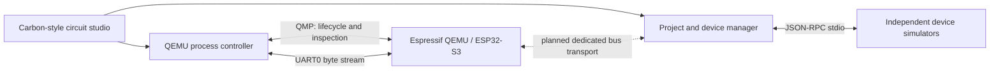

# Runtime architecture

The [2026-10-07 development plan](development-plan.md) expands this foundation
with analog/ADC, explicit virtual-time barriers, shared net truth and capability
contracts. Its reviewed contract takes precedence over preliminary bridge ideas here.

## Product/core boundary

The studio and device services communicate with an independently launched QEMU
executable. Keep QEMU patches in the QEMU source tree with their existing licenses.
Use Espressif's official fork as the maintained ESP32-S3 baseline and carry the
smallest explicit extension patch set needed for external devices. The recovered
owner fork is a source of candidate models, not a validated replacement baseline.

## Working paths

* QEMU process lifecycle, firmware flash preparation, UART, and QMP are implemented
  in `backend/QemuController`. Machine properties are discovered from the actual
  executable. Flash boot uses a merged image; ELF loading is explicitly a debug path.
* Device processes are managed by `backend/PeripheralManager` using JSON-RPC over
  stdio. Schema-driven panels already provide sensor/display/I/O interaction.
* `src/BoardWorkspace` edits project JSON and persists device layout and connection
  metadata. Shared I2C/SPI GPIO assignments are changed together. Invalid GPIO numbers
  are excluded; pin assignments must also agree with the firmware's GPIO matrix setup.
* Normal boot starts paused, initializes QMP/available cached bridge settings,
  then releases the CPU. GDB wait-for-attach stays paused; ROM download mode starts
  immediately without depending on QMP.

## Bridge replacement requirements

The existing extension emits tagged JSON on stderr, uses QOM response maps for
some I2C reads, and emits SPI TX data without a complete RX path. This transport
must be replaced before promising arbitrary sensor/device compatibility.

Use a QEMU chardev-backed local connection dedicated to bus events, with explicit
protocol version, transaction IDs, controller/endpoint IDs, virtual timestamps,
bounded payload lengths and deadlines. Return device read bytes and ACK/NACK/error
results to the pending emulated transaction. Never inject bus messages into UART0.
Do not block the QEMU main loop waiting for a host Python process; completion must
be scheduled through QEMU's event loop with deterministic timeout/error behavior.

An unresolved host-service dependency needs a virtual-time barrier or negotiated
time horizon while the Aio loop remains responsive. Host watchdogs report simulation
service failure; modeled NACK/stretch/timeout occurs at virtual deadlines. A timestamp
on an asynchronous reply alone does not remove host-speed effects. Scripted/replayed
input mode is deterministic; live network inputs require recording before replay.

For streaming buses, use bounded shared-memory/ring buffers or batched binary
frames. Virtual-time sequence numbers preserve ordering. Backpressure must not
silently drop display/audio/camera data. QMP remains a control/inspection plane.

Model GPIO nets separately from logical bus transactions. Track drivers and pin
direction, tri-state/open-drain behavior, pullups, contention and edge changes.
Peripheral functions route through GPIO matrix signals; the circuit editor's
saved wires must affect this routing rather than simply annotate controller IDs.

The accepted electrical scope also includes DC and linear RC voltages, finite
driver/pull/source impedance and native ADC sampling/calibration. Basic DC pad
resolution precedes digital net qualification; RC and ADC extend it. Unknown pad
states require explicit guest-bit sampling policy with diagnostic provenance.

## Acceptance rule

A capability is supported only when a reproducible fixture uses the ordinary
driver/framework, exercises meaningful input/output and failure cases, and checks
results against the chip documentation or hardware capture. CPU/SIMD tests need
reference vectors; register read/write storage alone does not qualify a peripheral.

Reference sources:

* [Official QEMU Xtensa target documentation](https://www.qemu.org/docs/master/system/target-xtensa.html)
* [Espressif ESP32-S3 QEMU guide](https://github.com/espressif/esp-toolchain-docs/blob/main/qemu/esp32s3/README.md)
* [Carbon developer overview](https://www.carbondesignsystem.com/getting-started/developing/overview)
* [QEMU license](https://www.qemu.org/docs/master/about/license.html)
